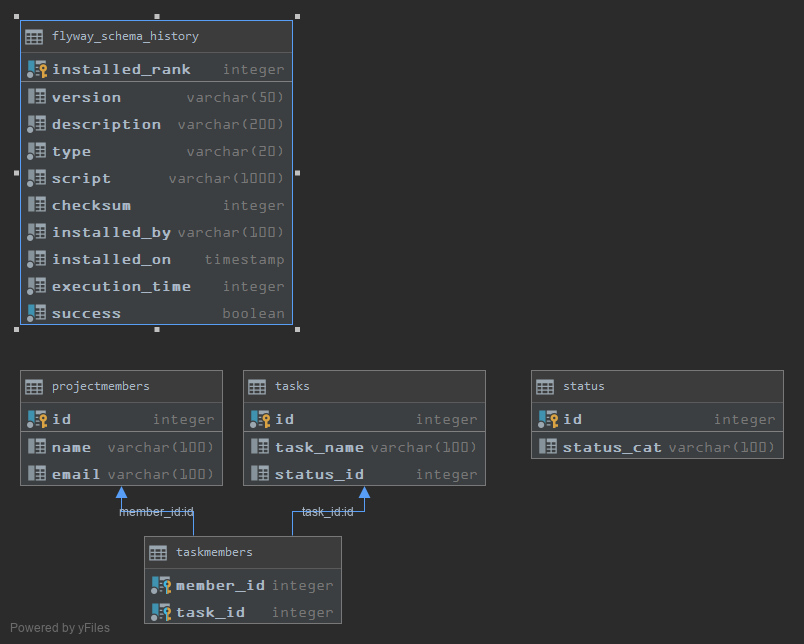

# PG203 Mappeinnlevering for gruppe 14

## Hvordan kjører dette programmet

## Bygg og test executable jar-fil
 
1. Hvilken kommando du kjøre?
     * mvn package
     * java -jar target\task-manager-1.0-SNAPSHOT.jar

   
2. Hvordan starter du programmet?
   før man begynner må man lage en task-manager.properties fil som inneholder:
   
   * dataSource.username = --------set inn ditt brukernavn
   * dataSource.password =  --------set inn ditt passord
   * dataSource.url = --------set inn inn din database URL
   
   java -jar target\task-manager-1.0-SNAPSHOT.jar
   gå inn på: http://localhost:8080/ i nettleser.

## Funksjonalitet:

1. Start Jar filen
2. Gå inn på :http://localhost:8080/
3. Velg hva du ønsker og gjøre ut i fra sidens funksjoner.
4. Sidens Funskjoner inkluderer:
* Legg til Prosjekt Medlem.
* Legg til Status.
* Legg til Oppgave.
* Legg oppgave til Medlem.
* Forandre status på oppgave.
* Liste ut alle Prosjktmedlemmer.
* Liste opp prosjektoppgaver, inkludert status og tildelte prosjektmedlemmer
* Filtrere oppgaver på tilordnet en prosjektmedlem
5. Man kan enkelt velge disse ved trykk på knappene og etter oppretting av nye objekter i databasen,
 returnerer man manuelt til hovedsiden via link.
 

## Designbeskrivelse:
# LInk til uml diagram:

# Data diagram Klasser:

# Data diagram Database:

## Egenevaluering:

Vi lærte en del nye ting om httpserver mot implementajson rundt database. 
Og vi lærte mye rundt database strukturering i henhold til koden som skal legge inn og lese fra databasen.

Vi parrporgrammerte godt og vi fikk til det meste av det vi hadde tiltenkt av implementasjon på oppgaven.

## Link til Parrprogramering:

https://www.youtube.com/watch?v=K5_XOQvgoGw

### Hva vi skulle ønske vi hadde gjort annerledes
Vi er klar over at moteodene for oppdatering av noe i databsen kunne vært gjort bedre.
Vi ønsket og finne en bedre metode for og liste ut de froskjellige oppgavene til medlemmer og medlemmer til oppgavene sli at ikke databasen kalles
 ved hver spørring igjennom løkken til metodene i geetbody() i ListTaskMemberHttpController og AddTaskMemberHttpController. 
 Det ble en større utfordring en forventet da vi introduserte en koblingstabell siden 2 av tabellene hadde et mange til mange forhold.

## Evaluering fra annen gruppe
Git link:
https://github.com/Westerdals/pgr203-2019-eksamen-Petlas88

## Evaluering gitt til annen gruppe
Git link:
https://github.com/Westerdals/pgr203-2019-eksamen-Petlas88/issues
